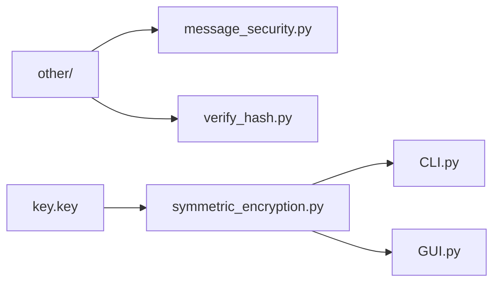
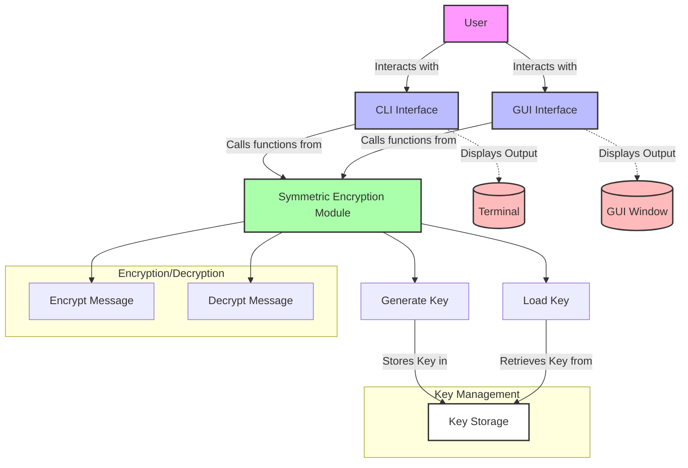

# Text Encryption and Decryption Tool

## Setup
```
pip install -r requirements.txt
```
# CLI Tool

This is a Python project that provides a text encryption and decryption tool using symmetric encryption.

## Usage

1. Run the script `symmetric_encryption.py` to import the necessary functions.
2. Execute the main script `text_encryption.py` to start the tool.
3. Choose one of the following options:
    - Encrypt a message: Enter `1`, `e`, or `E`.
    - Decrypt a message: Enter `2`, `d`, or `D`.
    - Exit the tool: Enter `3`, `break`, `b`, `B`, `exit`, or `Exit`.
4. Follow the prompts to enter the necessary information for encryption or decryption.
5. The tool will display the encrypted or decrypted message based on the chosen option.

## Dependencies

- Python 3.x
- The `symmetric_encryption` module
- The `rich` module


# GUI Tool


This is a Python project that provides a text encryption and decryption tool using symmetric encryption with a graphical user interface (GUI).

## Usage

1. Run the Magpie installer to install the necessary dependencies.
2. Enter the input text and key in the corresponding fields.
3. Choose one of the following options:
    - Encrypt a message: Select the `Encrypt` button.
    - Decrypt a message: Select the `Decrypt` button.
    - Exit the tool: Click the `X` button.
4. Follow the prompts to enter the necessary information for encryption or decryption.

### To encrypt-decrypt text files using the GUI tool:

1. Run the Magpie installer to install the necessary dependencies.
2. Click the `Open File` button to choose a text file.
3. Enter the key in the corresponding field.
4. Choose one of the following options:
    - Encrypt a message: Select the `Encrypt` button.
    - Decrypt a message: Select the `Decrypt` button.
    - Exit the tool: Click the `X` button.
5. Click on the `Convert` button to start the encryption or decryption process.
6. Save the encrypted or decrypted text file to the desired location.
7. Follow the prompts to enter the necessary information for encryption or decryption.

### Project Structure:
```
CLI.py
GUI.py
LICENSE
main.py
other/
    message_security.py
    verify_hash.py
plaintext.txt
README.md
requirements.txt
symmetric_encryption.py
```

### System Architecture:

## License

This project is licensed under the MIT License. See the [LICENSE](LICENSE) file for details.
